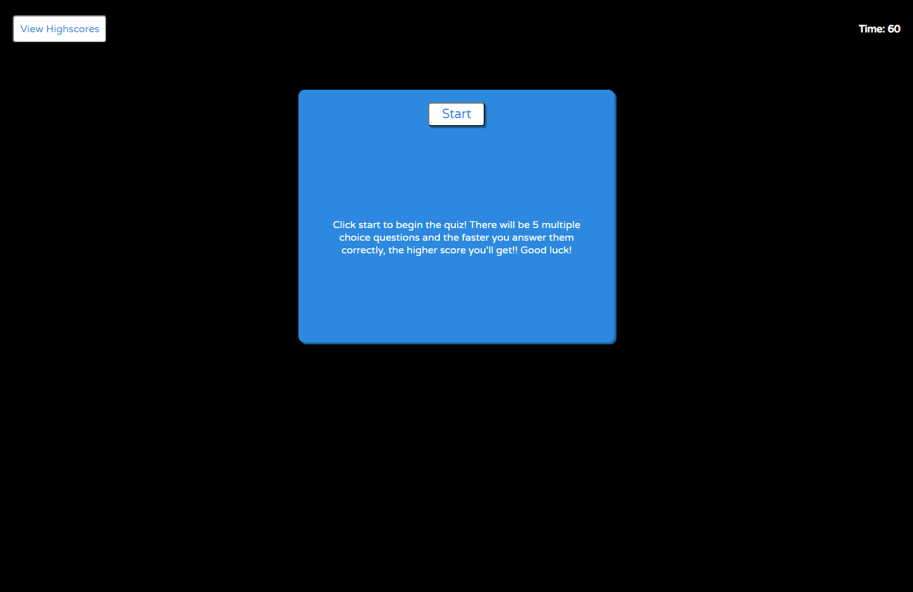

# Code-Quiz
Code-quiz consists of five multiple choice questions that are based on coding. Once the player clicks on the start button, the game will begin and the timer will countdown. Each time the player gets the answer right, a "Correct" message will appear below the question and if an incorrect answer is chosen, the message "Wrong" will appear and the game will deduct 10 seconds from the remaining time. Once the player finishes answering all questions, a form pops up for the player to input their initials. The initials and the remaining time will both be kept in the view highscores page. The player is also able to go to the highscore page and clear out the scores saved.

## Technologies used 
Code-quiz uses HTML, CSS, and mainly Javascript. Local storage is also used in order to save and store initials and scores. 

## Future Features
In the highscore page, user information will be organized automatically from highest to lowest score. 

## Links

https://github.com/ycheng2021/Code-Quiz

https://ycheng2021.github.io/Code-Quiz/

